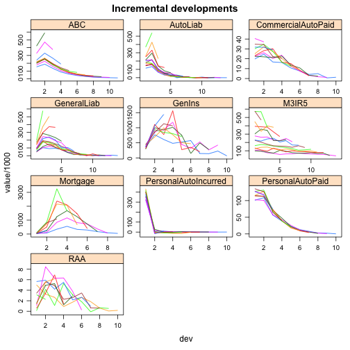

## Summarising Data
### Tables


```r
> testDataDir <- system.file("Database", package="ChainLadder")
> fn.csv <- paste(testDataDir,"/TestData.csv", sep="")
> myData <- read.csv(fn.csv, stringsAsFactors=TRUE)
> head(myData)
```

```
  origin dev  value lob
1   1977   1 153638 ABC
2   1978   1 178536 ABC
3   1979   1 210172 ABC
4   1980   1 211448 ABC
5   1981   1 219810 ABC
6   1982   1 205654 ABC
```

```r
> require(data.table)
> myData <- data.table(myData)
```

### Visual


```r
> myData[order(dev), cvalue:=cumsum(value), by=list(origin, lob)]
```

```
Error: Check that is.data.table(DT) == TRUE. Otherwise, := and `:=`(...)
are defined for use in j, once only and in particular ways. See
help(":=").
```

```r
> xyplot(value/1e3 ~ dev | lob, groups=origin, 
+                    data=myData, main="Incremental developments",
+                    scales="free", t="l", as.table=TRUE, layout=c(3,4))
```

 

```r
> xyplot(cvalue/1e3 ~ dev | lob, groups=origin, 
+                   data=myData, main="Cumulative developments",
+         scales="free", t="l", as.table=TRUE, layout=c(3,4))
```

```
Error: object 'cvalue' not found
```

```r
> #print(IncrPlot, position=c(0, 0, 0.5, 1), more=TRUE)
> #print(CumPlot, position=c(0.5, 0, 1, 1))
```

Note that the `echo = FALSE` parameter was added to the code chunk to prevent printing of the R code that generated the plot.

```r
> latestData <- myData[, .SD[max(dev)] , by=list(origin, lob) ]
```

```
Error: object 'dev' not found
```

```r
> head(latestData)
```

```
Error: object 'latestData' not found
```
