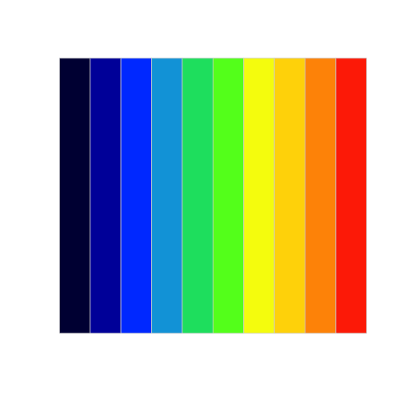
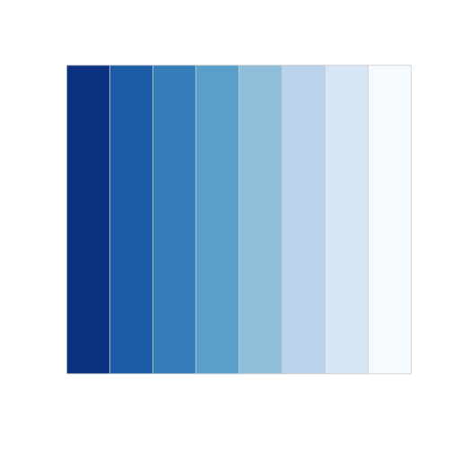
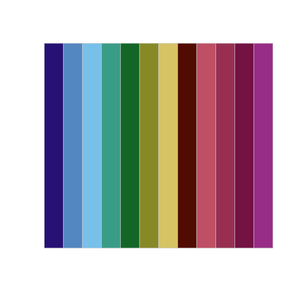
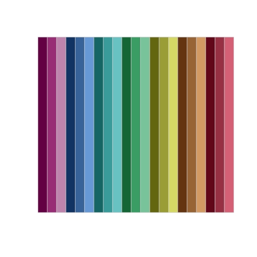
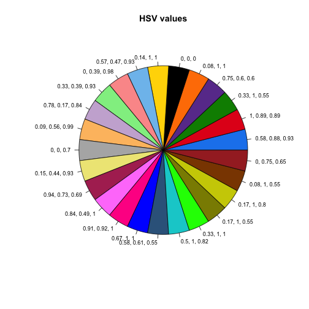

## Colors and test annotating R graphics


```r
> # Function for plotting colors side-by-side
> pal <- function(col, border = "light gray", ...){
+   n <- length(col)
+   plot(0, 0, type="n", xlim = c(0, 1), ylim = c(0, 1),
+        axes = FALSE, xlab = "", ylab = "", ...)
+   rect(0:(n-1)/n, 0, 1:n/n, 1, col = col, border = border)
+ }
> 
> # FOCUS PALETTES
> # Red as highlight
> redfocus = c("#CB181D", "#252525", "#525252", "#737373", "#969696", "#BDBDBD", "#D9D9D9", "#F0F0F0")
> 
> # Green as highlight
> greenfocus = c("#41AB5D", "#252525", "#525252", "#737373", "#969696", "#BDBDBD", "#D9D9D9", "#F0F0F0")
> 
> # Blue as highlight
> bluefocus = c("#0033FF", "#252525", "#525252", "#737373", "#969696", "#BDBDBD", "#D9D9D9", "#F0F0F0")
> 
> pal(bluefocus)
```

 

```r
> # EQUAL WEIGHT
> # Generated with rainbow(12, s = 0.6, v = 0.75)
> rainbow12equal = c("#BF4D4D", "#BF864D", "#BFBF4D", "#86BF4D", "#4DBF4D", "#4DBF86", "#4DBFBF", "#4D86BF", "#4D4DBF", "#864DBF", "#BF4DBF", "#BF4D86")
> rainbow10equal = c("#BF4D4D", "#BF914D", "#A8BF4D", "#63BF4D", "#4DBF7A", "#4DBFBF", "#4D7ABF", "#634DBF", "#A84DBF", "#BF4D91")
> rainbow8equal = c("#BF4D4D", "#BFA34D", "#86BF4D", "#4DBF69", "#4DBFBF", "#4D69BF", "#864DBF", "#BF4DA3")
> rainbow6equal = c("#BF4D4D", "#BFBF4D", "#4DBF4D", "#4DBFBF", "#4D4DBF", "#BF4DBF")
> 
> # Generated with package "gplots" function rich.colors(12)
> rich12equal = c("#000040", "#000093", "#0020E9", "#0076FF", "#00B8C2", "#04E466", "#49FB25", "#E7FD09", "#FEEA02", "#FFC200", "#FF8500", "#FF3300")
> rich10equal = c("#000041", "#0000A9", "#0049FF", "#00A4DE", "#03E070", "#5DFC21", "#F6F905", "#FFD701", "#FF9500", "#FF3300")
> rich8equal = c("#000041", "#0000CB", "#0081FF", "#02DA81", "#80FE1A", "#FDEE02", "#FFAB00", "#FF3300")
> rich6equal = c("#000043", "#0033FF", "#01CCA4", "#BAFF12", "#FFCC00", "#FF3300")
> 
> # Generated with package "fields" function tim.colors(12), which is said to emulate the default matlab colorset
> tim12equal = c("#00008F", "#0000EA", "#0047FF", "#00A2FF", "#00FEFF", "#5AFFA5", "#B5FF4A", "#FFED00", "#FF9200", "#FF3700", "#DB0000", "#800000")
> tim10equal = c("#00008F", "#0000FF", "#0070FF", "#00DFFF", "#50FFAF", "#BFFF40", "#FFCF00", "#FF6000", "#EF0000", "#800000")
> tim8equal = c("#00008F", "#0020FF", "#00AFFF", "#40FFBF", "#CFFF30", "#FF9F00", "#FF1000", "#800000")
> tim6equal = c("#00008F", "#005AFF", "#23FFDC", "#ECFF13", "#FF4A00", "#800000")
> 
> # Generated with sort(brewer.pal(8,"Dark2")) #Dark2, Set2
> dark8equal = c("#1B9E77", "#666666", "#66A61E", "#7570B3", "#A6761D", "#D95F02", "#E6AB02", "#E7298A")
> dark6equal = c("#1B9E77", "#66A61E", "#7570B3", "#D95F02", "#E6AB02", "#E7298A")
> set8equal = c("#66C2A5", "#8DA0CB", "#A6D854", "#B3B3B3", "#E5C494", "#E78AC3", "#FC8D62", "#FFD92F")
> set6equal = c("#66C2A5", "#8DA0CB", "#A6D854", "#E78AC3", "#FC8D62", "#FFD92F")
> 
> pal(rich10equal)
```

 

```r
> # MONOCHROME PALETTES
> # sort(brewer.pal(8,"Greens"))
> redmono = c("#99000D", "#CB181D", "#EF3B2C", "#FB6A4A", "#FC9272", "#FCBBA1", "#FEE0D2", "#FFF5F0")
> greenmono = c("#005A32", "#238B45", "#41AB5D", "#74C476", "#A1D99B", "#C7E9C0", "#E5F5E0", "#F7FCF5")
> bluemono = c("#084594", "#2171B5", "#4292C6", "#6BAED6", "#9ECAE1", "#C6DBEF", "#DEEBF7", "#F7FBFF")
> grey8mono = c("#000000","#252525", "#525252", "#737373", "#969696", "#BDBDBD", "#D9D9D9", "#F0F0F0")
> grey6mono = c("#242424", "#494949", "#6D6D6D", "#929292", "#B6B6B6", "#DBDBDB")
> 
> pal(bluemono)
```

 

```r
> # Qualitative color schemes by Paul Tol
> tol1qualitative=c("#4477AA")
> tol2qualitative=c("#4477AA", "#CC6677")
> tol3qualitative=c("#4477AA", "#DDCC77", "#CC6677")
> tol4qualitative=c("#4477AA", "#117733", "#DDCC77", "#CC6677")
> tol5qualitative=c("#332288", "#88CCEE", "#117733", "#DDCC77", "#CC6677")
> tol6qualitative=c("#332288", "#88CCEE", "#117733", "#DDCC77", "#CC6677","#AA4499")
> tol7qualitative=c("#332288", "#88CCEE", "#44AA99", "#117733", "#DDCC77", "#CC6677","#AA4499")
> tol8qualitative=c("#332288", "#88CCEE", "#44AA99", "#117733", "#999933", "#DDCC77", "#CC6677","#AA4499")
> tol9qualitative=c("#332288", "#88CCEE", "#44AA99", "#117733", "#999933", "#DDCC77", "#CC6677", "#882255", "#AA4499")
> tol10qualitative=c("#332288", "#88CCEE", "#44AA99", "#117733", "#999933", "#DDCC77", "#661100", "#CC6677", "#882255", "#AA4499")
> tol11qualitative=c("#332288", "#6699CC", "#88CCEE", "#44AA99", "#117733", "#999933", "#DDCC77", "#661100", "#CC6677", "#882255", "#AA4499")
> tol12qualitative=c("#332288", "#6699CC", "#88CCEE", "#44AA99", "#117733", "#999933", "#DDCC77", "#661100", "#CC6677", "#AA4466", "#882255", "#AA4499")
> 
> pal(tol12qualitative)
```

 

```r
> tol14rainbow=c("#882E72", "#B178A6", "#D6C1DE", "#1965B0", "#5289C7", "#7BAFDE", "#4EB265", "#90C987", "#CAE0AB", "#F7EE55", "#F6C141", "#F1932D", "#E8601C", "#DC050C")
> tol15rainbow=c("#114477", "#4477AA", "#77AADD", "#117755", "#44AA88", "#99CCBB", "#777711", "#AAAA44", "#DDDD77", "#771111", "#AA4444", "#DD7777", "#771144", "#AA4477", "#DD77AA")
> tol18rainbow=c("#771155", "#AA4488", "#CC99BB", "#114477", "#4477AA", "#77AADD", "#117777", "#44AAAA", "#77CCCC", "#777711", "#AAAA44", "#DDDD77", "#774411", "#AA7744", "#DDAA77", "#771122", "#AA4455", "#DD7788")
> # ...and finally, the Paul Tol 21-color salute
> tol21rainbow= c("#771155", "#AA4488", "#CC99BB", "#114477", "#4477AA", "#77AADD", "#117777", "#44AAAA", "#77CCCC", "#117744", "#44AA77", "#88CCAA", "#777711", "#AAAA44", "#DDDD77", "#774411", "#AA7744", "#DDAA77", "#771122", "#AA4455", "#DD7788")
> 
> pal(tol21rainbow)
```

 

```r
> mycols=c("dodgerblue2", "#E31A1C", "green4", "#6A3D9A", "#FF7F00", "black",
+          "gold1", "skyblue2", "#FB9A99", "palegreen2", "#CAB2D6", "#FDBF6F",
+          "gray70", "khaki2", "maroon", "orchid1", "deeppink1", "blue1",
+          "steelblue4", "darkturquoise", "green1", "yellow4", "yellow3",
+          "darkorange4", "brown")
> 
> ones <- rep(1, length=length(mycols))
> # Get hsv for labels
> names(ones) <- apply(round(rgb2hsv(col2rgb(c(mycols))),2), 2,
+                      function(x) {paste(x, collapse=", ")})
> pie(ones, col=mycols, cex=.75, main = "HSV values")
```

 
