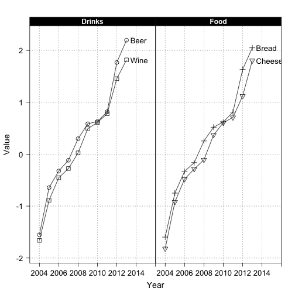

Some text mining tips from the internet.


```r
# install.packages("httr")
library(httr)
 
# Find the most recent R questions on stackoverflow
r <- GET(
  "http://api.stackexchange.com",
  path = "questions",
  query = list(
    site = "stackoverflow.com",
    tagged = "r"
  )
)
```

You can also embed plots, for example:

 

Note that the `echo = FALSE` parameter was added to the code chunk to prevent printing of the R code that generated the plot.
